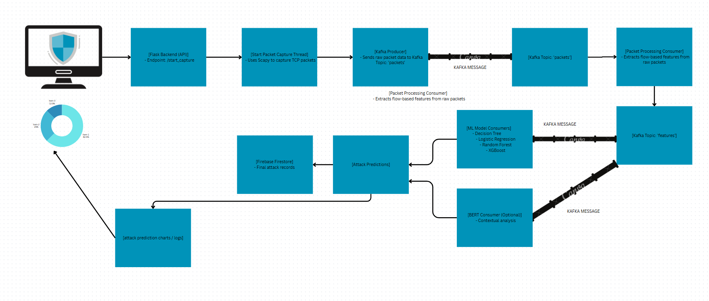
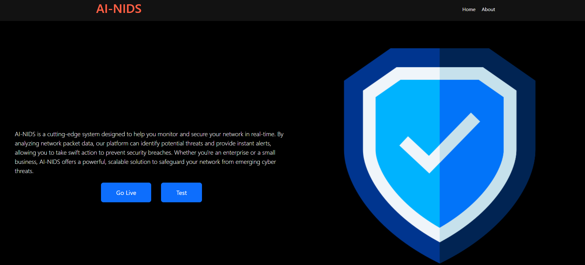
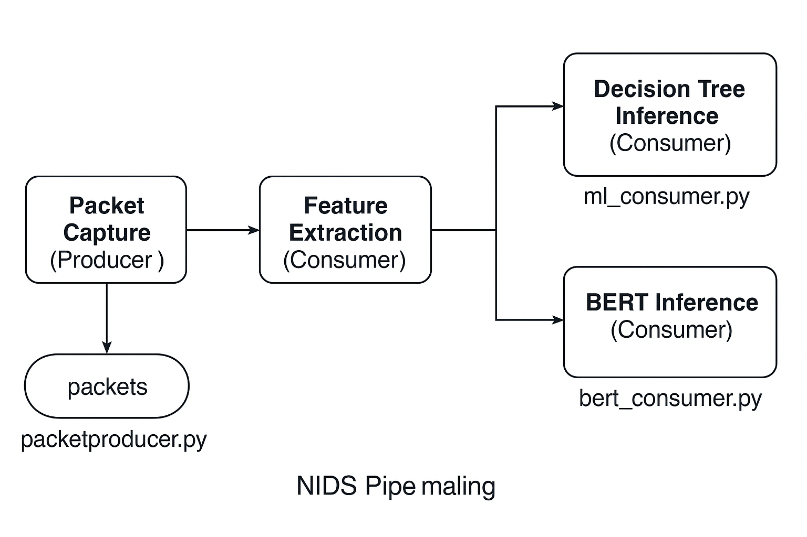
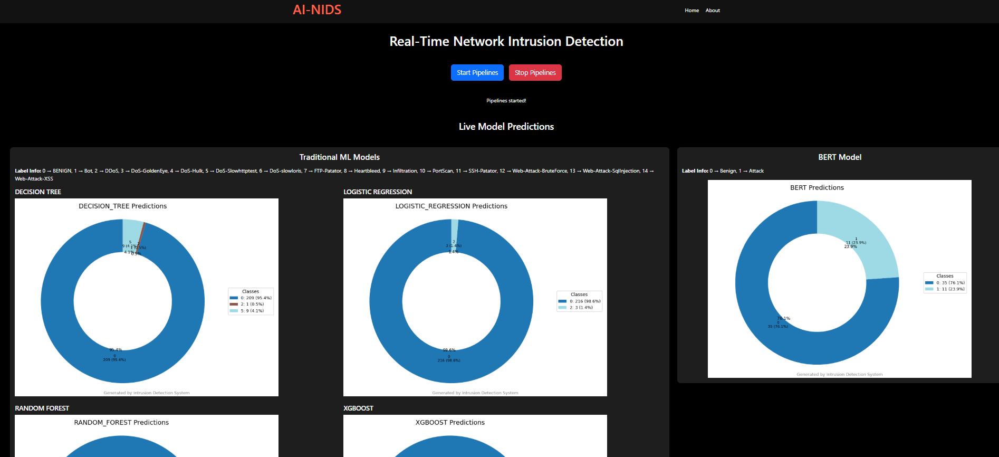
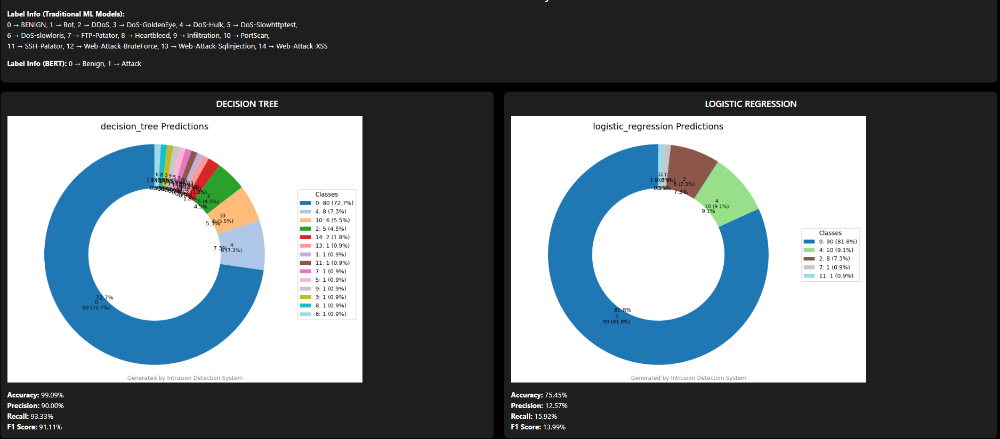
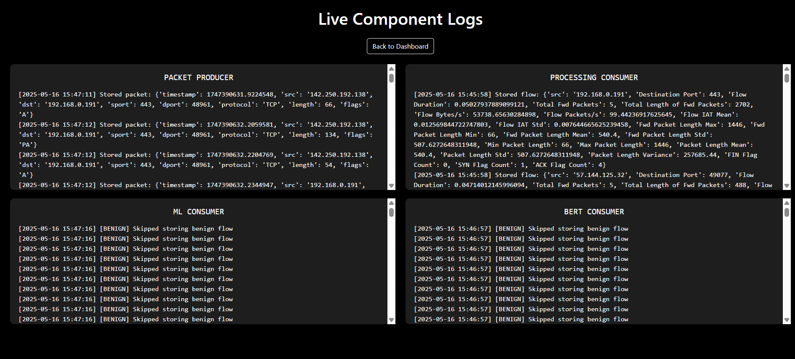
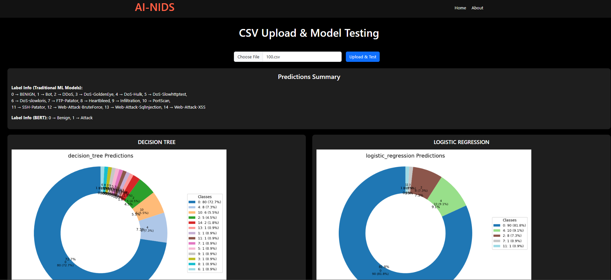
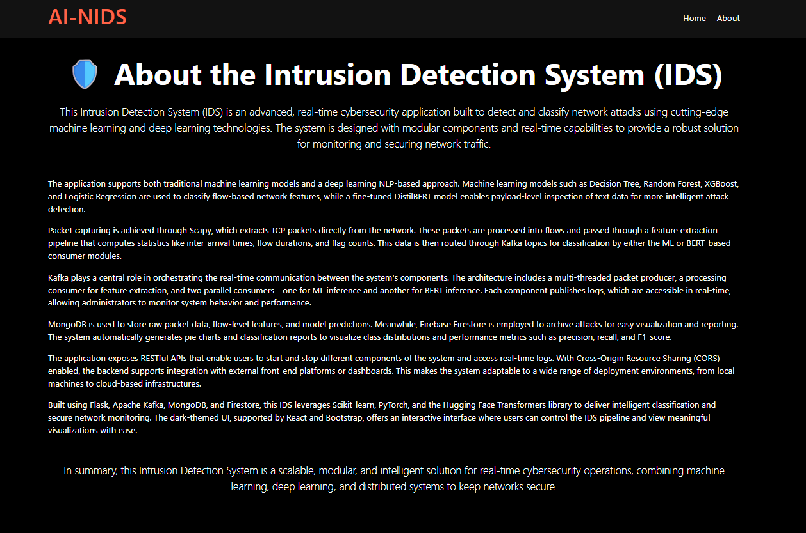

# AI-NIDS  
### AI-Powered Real-Time Network Intrusion Detection System  
A modular full-stack cybersecurity system combining machine learning, deep learning, Kafka-based streaming, and a real-time monitoring dashboard.

---

## Overview

AI-NIDS is a production-grade Network Intrusion Detection System (NIDS) engineered to detect and classify cyberattacks in real time.  
The system captures live TCP packets, extracts flow features, streams data through Apache Kafka, and performs multi-model inference using both classical machine learning models and transformer-based deep learning.

This project demonstrates full-stack engineering, machine learning deployment, distributed systems design, and real-time visualization under a unified architecture.

---

# System Architecture


The system follows a microservices-style architecture using Kafka as the central messaging backbone.

### End-to-End Data Flow

1. **Packet Producer (Flask + Scapy)**  
   - Captures TCP packets  
   - Pushes raw packets to Kafka topic `packets`  

2. **Packet Processor Consumer**  
   - Converts packets into aggregated network flows  
   - Extracts statistical flow features  
   - Publishes processed features to Kafka topic `features`  

3. **Parallel Model Consumers**  
   Independent inference services consuming from `features`:  
   - Decision Tree  
   - Random Forest  
   - Logistic Regression  
   - XGBoost  

4. **BERT Consumer (DistilBERT Model)**  
   - Performs contextual binary classification of flows  
   - Enables payload-like NLP analysis  

5. **Databases**  
   - **MongoDB** for raw packets, flows, predictions  
   - **Firestore** for real-time frontend syncing  

6. **Frontend (React)**  
   - Real-time prediction charts  
   - Live logs viewer  
   - CSV upload for batch model testing  
   - Pipeline start/stop controls  

---

# Key Features

### Real-Time IDS Pipeline
- Live packet sniffing  
- Kafka-based streaming for high throughput  
- Parallel ML/DL inference  
- Near-zero delay visualization  

### Multi-Model Attack Classification
- Decision Tree  
- Random Forest  
- Logistic Regression  
- XGBoost  
- DistilBERT (Transformer Model)  

Models run as independent services for scalability.

### Full-Stack Web Dashboard
Built with React.js:

- Real-time donut charts  
- Live system logs  
- CSV upload for offline testing  
- Dark-mode cyber dashboard  
- Live Firestore syncing  

### Storage Layer
- **MongoDB** persists raw and processed data  
- **Firestore** syncs live prediction stats to frontend  

### Scalable Microservice Architecture
Every component is container-ready:

- Packet Producer  
- Packet Processor  
- ML Consumers  
- BERT Consumer  
- Flask API  
- React Frontend  
- Kafka + Zookeeper  

Supports distributed deployment and horizontal scaling.

---

# Screenshots

### Homepage


### Architecture Flow


### Live Model Predictions


### BERT Predictions


### Component Logs (Live)


### CSV Upload & Testing


### About Page


---

# Backend (Flask)

### Tech Stack
- Python  
- Flask  
- Scapy  
- Apache Kafka  
- MongoDB  
- Firestore  
- PyTorch + Transformers  
- Scikit-learn, XGBoost  
- Matplotlib  

### Core Backend Responsibilities

#### Packet Producer  
- Live capture of TCP packets  
- Extracts IPs, ports, flags, size  
- Publishes to Kafka  

#### Packet Processor  
- Builds flow statistics (duration, IAT, packet sizes, flag counts, etc.)  
- Publishes feature vectors to ML pipelines  

#### ML Consumers  
- Load pre-trained `.joblib` models  
- Perform multi-class intrusion classification  
- Persist results into MongoDB  
- Push summaries to Firestore  

#### BERT Consumer  
- Fine-tuned DistilBERT for binary attack detection  
- Provides contextual analysis beyond numeric features  

#### Chart Generation  
- Backend dynamically generates donut charts via Matplotlib  

---

# Frontend (React)

### UI Modules
- Landing Page  
- Go Live Dashboard  
- Live Logs Viewer  
- CSV Upload + Testing Module  
- ML Results Visualization  

### Technologies Used
- React.js  
- Axios  
- Bootstrap  
- Custom CSS  

---

# Machine Learning Models

### Classical Machine Learning  
Trained on CICIDS2017:

- Decision Tree  
- Random Forest  
- Logistic Regression  
- XGBoost  

Stored as `.joblib` for efficient FastAPI-style inference.

### Deep Learning (DistilBERT)
- Fine-tuned transformer model  
- Binary classifier (Benign vs Attack)  
- Processes textual flow representations  
- Provides contextual intelligence missing in statistical features  

---

# Strengths of the System (Engineering Perspective)

### Distributed Real-Time Architecture
Kafka-based streaming similar to modern enterprise data pipelines.

### Fully Decoupled ML Inference Workers
Each ML model runs independently for scalability and isolation.

### Real-Time Monitoring UI
Live charts, logs, and system insights.

### Modular, Extensible Design
New models or processors can be added with zero changes to existing services.

### Production-Oriented Stack
Includes:
- Load isolation  
- Real-time sync  
- Scalable storage  
- Docker-ready services  
---

## Folder Structure
```
AI-NIDS/
│
├── backend/            # Python backend API and processing logic
│   ├── producers/      # Kafka producers for network packet capture
│   ├── consumers/      # Kafka consumers for processing data
│   ├── models/         # Trained AI/ML models
│   ├── charts/         # Logic for generating analytics charts
│   ├── app.py          # Main backend application entry point
│
├── frontend/           # React frontend application
│   ├── src/            # Source code for UI components
│   ├── public/         # Static assets
│
├── images/             # Documentation images and screenshots
│   ├── home.png
│   ├── logs.png
│   ├── live_predictions.png
│   ├── architecture_flow.png
│
└── README.md
```
## Installation & Setup
Follow these steps to set up the project locally.

## 1. Clone the Repository
```
git clone [https://github.com/your-username/AI-NIDS.git](https://github.com/your-username/AI-NIDS.git)
cd AI-NIDS
```

## 2. Backend Setup

Navigate to the backend directory, install dependencies, and start the application.
```
cd backend
pip install -r requirements.txt
python app.py
```

## 3. Kafka Setup

Ensure you have Apache Kafka installed and added to your path. You will need three separate terminal windows for this step.
Terminal 1: Start Zookeeper
```
zookeeper-server-start.sh config/zookeeper.properties
```
Terminal 2: Start Kafka Server
```
kafka-server-start.sh config/server.properties
```
Terminal 3: Create Topics
```
# Create topic for raw packets
kafka-topics.sh --create --topic packets --bootstrap-server localhost:9092
# Create topic for processed features
kafka-topics.sh --create --topic features --bootstrap-server localhost:9092
```

## 4. Frontend Setup
Navigate to the frontend directory, install dependencies, and launch the development server.
```
cd frontend
npm install
npm start
```
